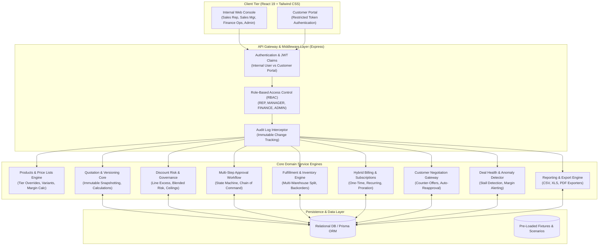
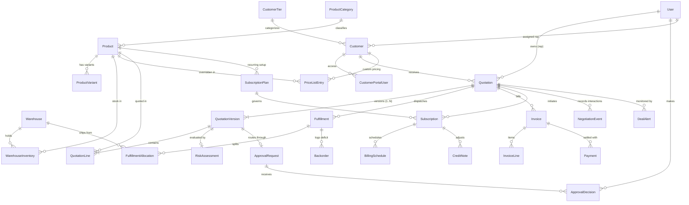

# DealFlow360 — Architecture & System Design

DealFlow360 is an enterprise-grade Sales Operations and Governance Engine designed to automate and enforce business rules across the quote-to-cash lifecycle.

---

## 1. High-Level System Architecture

The system is decoupled into an Express/Node.js REST API layer with Prisma ORM and SQLite/PostgreSQL persistence, coupled with a React 19 single-page client built on Tailwind CSS and a Monochrome Editorial design system.

---

## 2. Relational Data Model (Entity Relationship)

---

## 3. Key Architectural Decisions

### 1. Immutable Quotation Versioning (`QuotationVersion`)
Risk, approvals, and line-item snapshots are pinned to a `QuotationVersion` rather than the mutable `Quotation` parent entity. When a customer or sales rep amends a quote after approval, a new version is created. This guarantees that an approval cannot be silently inherited by modified commercial terms.

### 2. Isolated Customer Portal Security
`CustomerPortalUser` is isolated from the internal `User` model, featuring distinct password hashes, strict customer-scoped data access, and dedicated JWT secrets. A customer portal token cannot invoke internal administrative endpoints.

### 3. Separation of Risk Assessment & Approval State
The `RiskAssessment` engine evaluates mathematical discount excess and blended risk as a pure, deterministic function. The `ApprovalRequest` handles the state machine (Pending, Approved, Rejected, Revision Required) across multiple stakeholders. This separation ensures risk can be recalculated on-the-fly without corrupting in-flight approval chains.

### 4. Heuristic Multi-Warehouse Fulfillment
The fulfillment engine dynamically evaluates inventory across warehouses, applying location proximity and shipping cost weightings (`shippingCostWeight`) to minimize the total number of shipments and logistics overhead. If stock is insufficient, backorders are generated automatically.

### 5. Dual-Stream Hybrid Billing
A single quotation can cleanly bridge one-time capital purchases and ongoing subscription contracts. The billing service routes one-time lines directly to upfront fulfillment invoices, while recurring lines generate subscription plans with customizable proration, cancellation, and scheduled recurring billing cycles.
